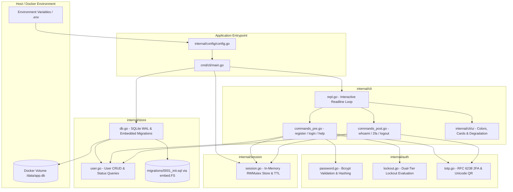
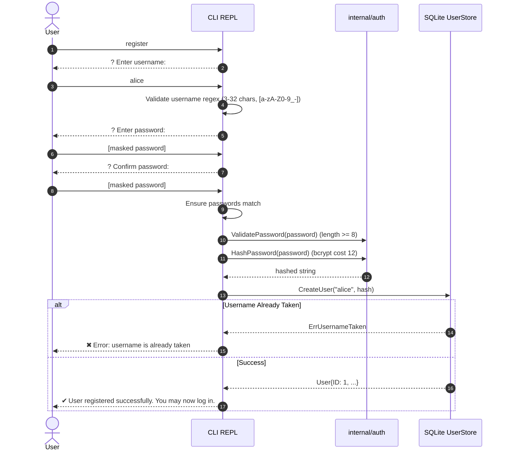
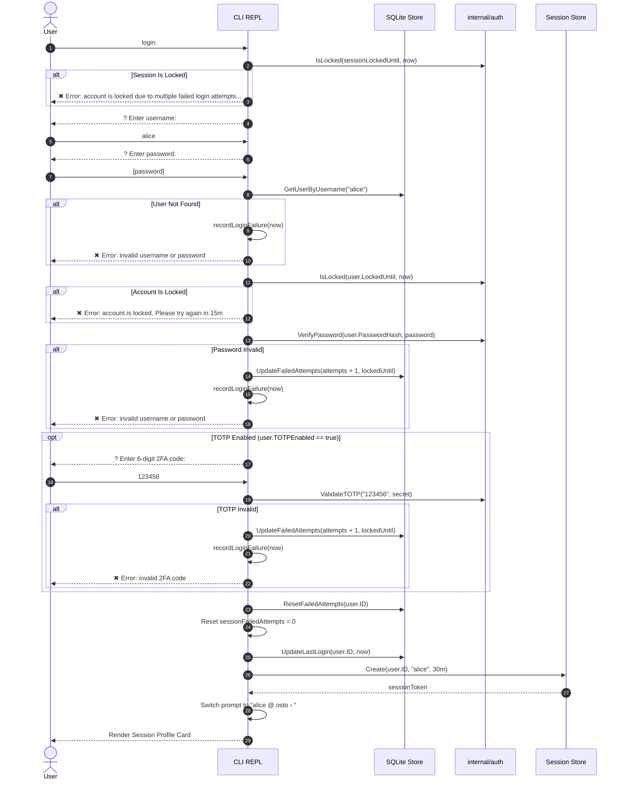
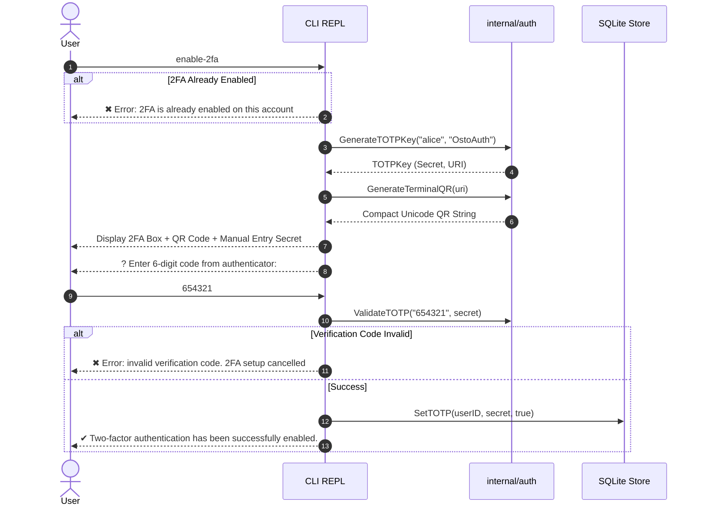
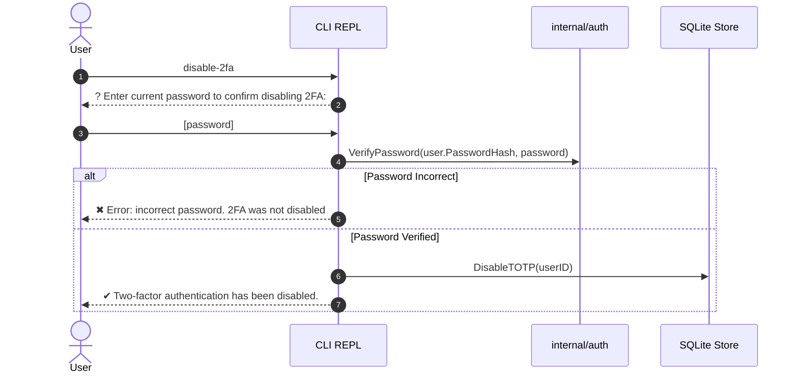

# System Architecture & Technical Design Document

This document provides a comprehensive technical overview of the **Osto CLI Authentication System**, detailing its architectural layers, request flows, data models, security mitigations, and design rationale.

---

## 1. High-Level Architecture Overview

The application follows a clean, layered architecture with strict separation of concerns between presentation, domain security logic, in-memory state, and storage persistence.



---

## 2. Component Layers & File Directory Mapping

| Package | Path | Responsibility |
| :--- | :--- | :--- |
| `cmd/cli` | [`cmd/cli/main.go`](file:///home/uttam/dev/osto-cli-auth/cmd/cli/main.go) | Bootstrap entrypoint: loads configuration, opens SQLite, runs migrations, initializes stores, and traps OS signals (`SIGINT`, `SIGTERM`) for clean shutdown. |
| `internal/config` | [`internal/config/config.go`](file:///home/uttam/dev/osto-cli-auth/internal/config/config.go) | Reads configuration from environment variables with sensible defaults (`DB_PATH`, `SESSION_TIMEOUT_MINUTES`, `LOCKOUT_THRESHOLD`, `LOCKOUT_DURATION_MINUTES`). |
| `internal/store` | [`internal/store/db.go`](file:///home/uttam/dev/osto-cli-auth/internal/store/db.go) | Database connection lifecycle, pragmas configuration (`WAL`, foreign keys, busy timeout), and migration runner. |
| `internal/store` | [`internal/store/user.go`](file:///home/uttam/dev/osto-cli-auth/internal/store/user.go) | Data Access Object (DAO) for `User` records: creation, lookups, failed attempt updates, lockout management, last login updates, and TOTP flag persistence. |
| `internal/store/migrations` | [`0001_init.up.sql`](file:///home/uttam/dev/osto-cli-auth/internal/store/migrations/0001_init.up.sql) | Baseline schema definition compiled into the binary using Go's `embed.FS`. |
| `internal/auth` | [`internal/auth/password.go`](file:///home/uttam/dev/osto-cli-auth/internal/auth/password.go) | Length validation (min 8 chars), bcrypt cost 12 hashing, and constant-time password verification. |
| `internal/auth` | [`internal/auth/lockout.go`](file:///home/uttam/dev/osto-cli-auth/internal/auth/lockout.go) | Pure business logic evaluating consecutive failures, lockout durations, and lock expiration status. |
| `internal/auth` | [`internal/auth/totp.go`](file:///home/uttam/dev/osto-cli-auth/internal/auth/totp.go) | RFC 6238 TOTP key generation (Secret & URI), passcode verification, and terminal Unicode QR code rendering. |
| `internal/session` | [`internal/session/session.go`](file:///home/uttam/dev/osto-cli-auth/internal/session/session.go) | In-memory, thread-safe session store with passive access-based TTL expiration. |
| `internal/cli` | [`internal/cli/repl.go`](file:///home/uttam/dev/osto-cli-auth/internal/cli/repl.go) | Interactive Readline loop, tab-completion dispatch, masked password input, and session-level lockout tracking. |
| `internal/cli` | [`internal/cli/commands_pre.go`](file:///home/uttam/dev/osto-cli-auth/internal/cli/commands_pre.go) | Handlers for unauthenticated operations: `register`, `login`, and pre-login `help`. |
| `internal/cli` | [`internal/cli/commands_post.go`](file:///home/uttam/dev/osto-cli-auth/internal/cli/commands_post.go) | Handlers for authenticated operations: `whoami`, `enable-2fa`, `disable-2fa`, `logout`, and post-login `help`. |
| `internal/cli/ui` | [`internal/cli/ui/style.go`](file:///home/uttam/dev/osto-cli-auth/internal/cli/ui/style.go) | ANSI color palette, status badges (`✔`, `✖`, `⚠`, `ℹ`), and automatic `NO_COLOR` / non-TTY degradation. |
| `internal/cli/ui` | [`internal/cli/ui/card.go`](file:///home/uttam/dev/osto-cli-auth/internal/cli/ui/card.go) | Rounded border geometry, session profile cards, and aligned tabular help formatters. |

---

## 3. Data Model & Database Architecture

### SQLite Schema

The SQLite database uses embedded migrations tracked by the `schema_migrations` table.

```sql
CREATE TABLE IF NOT EXISTS users (
    id INTEGER PRIMARY KEY AUTOINCREMENT,
    username TEXT NOT NULL COLLATE NOCASE,
    password_hash TEXT NOT NULL,
    totp_secret TEXT,
    totp_enabled INTEGER NOT NULL DEFAULT 0,
    failed_attempts INTEGER NOT NULL DEFAULT 0,
    locked_until DATETIME,
    created_at DATETIME NOT NULL DEFAULT CURRENT_TIMESTAMP,
    last_login_at DATETIME
);

CREATE UNIQUE INDEX IF NOT EXISTS idx_users_username ON users (username);
```

### Database Pragmas & Concurrency
The database connection pool in [`internal/store/db.go`](file:///home/uttam/dev/osto-cli-auth/internal/store/db.go) executes the following pragmas immediately upon opening:
1. `PRAGMA journal_mode = WAL;`: Write-Ahead Logging allows concurrent readers without blocking writes.
2. `PRAGMA foreign_keys = ON;`: Enforces relational integrity.
3. `PRAGMA busy_timeout = 5000;`: Waits up to 5 seconds if the database is locked before returning `sqlite busy` errors.
4. `db.SetMaxOpenConns(1)`: Serializes database write operations to prevent `database is locked` race conditions in SQLite.

---

## 4. End-to-End Request Flows

### 4.1. User Registration Flow (`register`)



---

### 4.2. User Authentication Flow (`login`)

The login workflow incorporates a **dual-tier lockout defense**:
1. **Tier 1 (CLI Session Lockout)**: Tracks consecutive failed attempts in the running terminal session across any inputs (empty usernames, unknown usernames, or typos).
2. **Tier 2 (Account-Level Lockout)**: Tracks consecutive failed attempts in SQLite per user record.



---

### 4.3. Two-Factor Authentication Setup (`enable-2fa`)

To guarantee users do not lock themselves out with unverified 2FA secrets:
1. Secret keys are created in memory and rendered as a terminal Unicode QR code and raw Base32 string.
2. The user must provide a valid 6-digit code matching the new secret.
3. Only upon successful code verification is `totp_secret` persisted and `totp_enabled = 1` set in SQLite.



---

### 4.4. Disabling Two-Factor Authentication (`disable-2fa`)

Disabling two-factor authentication relaxes account security. To prevent an active session from being hijacked while the terminal is momentarily unattended, the user **must enter their current password** before 2FA is deactivated:



---

## 5. Architectural Decisions & Trade-Offs

### 1. Pure-Go SQLite Driver (`modernc.org/sqlite`) vs CGO (`mattn/go-sqlite3`)
* **Decision**: Adopt pure-Go SQLite via `modernc.org/sqlite`.
* **Rationale**: Compiling with `CGO_ENABLED=0` produces a completely static binary without dependencies on libc, musl, or a C compiler (`gcc`).
* **Benefits**:
  - Secure, minimal runtime Alpine Docker containers.
  - Cross-compilation across platforms without cross-toolchains.
  - Elimination of CGO memory boundary overheads for CLI commands.

### 2. In-Memory Session Store vs Database Persistence
* **Decision**: Manage sessions entirely in-memory using a thread-safe map protected by `sync.RWMutex`.
* **Rationale**: An interactive CLI is scoped to the lifetime of the process. When the user exits the terminal or stops the container, the session naturally terminates.
* **Benefits**:
  - Zero disk I/O on session checks.
  - Enhanced security: session tokens are never written to disk, preventing token extraction from persisted database files.

### 3. Passive TTL Expiration vs Background Sweeper Goroutine
* **Decision**: Check and evict expired sessions on access ([`Store.Get()`](file:///home/uttam/dev/osto-cli-auth/internal/session/session.go#L42)).
* **Rationale**: A background ticker/goroutine that periodically sweeps the map consumes idle CPU cycles and introduces asynchronous concurrency concerns.
* **Benefits**:
  - Simple, deterministic behavior.
  - Thread-safe eviction at the exact moment a user attempts a command.

### 4. Dual-Tier Lockout Defense
* **Decision**: Track consecutive failed logins at both the SQLite user record level and the in-memory CLI REPL session level.
* **Rationale**: If lockout were only tracked against existing user records, an attacker could bombard the terminal with non-existent usernames (`admin`, `root`, `test`) without ever getting rate-limited or locked out.
* **Benefits**:
  - Brute force protection against password guessing on known accounts.
  - Denial-of-service mitigation preventing infinite automated trial attempts in the terminal session.
  - Zero username enumeration: generic `"invalid username or password"` responses prevent probing for valid accounts.

### 5. Masked Password Input via `golang.org/x/term`
* **Decision**: Use `term.ReadPassword(int(os.Stdin.Fd()))` when standard input is a terminal, with fallback to standard line reading for non-TTY / pipe execution.
* **Rationale**: The built-in `readline.ReadPassword()` mutates readline internal configurations concurrently with its internal `ioloop` goroutine, triggering data race warnings under Go's race detector (`go test -race`).
* **Benefits**:
  - 100% clean data race detection.
  - Masked inputs in terminal environments.
  - Clean non-blocking execution in automated test pipelines and shell scripts.

### 6. Zero-Dependency Terminal UI Engine (`internal/cli/ui`)
* **Decision**: Implement a custom, stdlib-first UI formatting package rather than importing heavy frameworks like Bubble Tea or Lipgloss.
* **Rationale**: Full TUI frameworks (e.g. Bubble Tea) seize control of the alternate screen buffer and interfere with standard Readline line-editing, history navigation, and signal trapping.
* **Benefits**:
  - Zero binary bloat.
  - Full support for standard terminal conventions: respects `NO_COLOR` (https://no-color.org) and non-TTY redirection.
  - ANSI-invariant string padding ensures rounded card borders (`╭───╮`, `╰───╯`) align down to the single visual rune.

---

## 6. Threat Model & Security Posture

| Threat | Mitigation Strategy | Implementation |
| :--- | :--- | :--- |
| **Credential Brute-Force** | Bcrypt work factor 12 + 5-attempt / 15-minute lockout policy. | [`password.go`](file:///home/uttam/dev/osto-cli-auth/internal/auth/password.go), [`lockout.go`](file:///home/uttam/dev/osto-cli-auth/internal/auth/lockout.go) |
| **Username Enumeration** | Constant-time failure paths and identical error messages for nonexistent users vs wrong passwords. | [`commands_pre.go:L92`](file:///home/uttam/dev/osto-cli-auth/internal/cli/commands_pre.go#L92) |
| **Credential Stuffing via REPL** | Session-level failure tracking locks the CLI session after 5 attempts across any username. | [`repl.go:L266`](file:///home/uttam/dev/osto-cli-auth/internal/cli/repl.go#L266) |
| **Session Hijacking** | Cryptographically secure UUID tokens held exclusively in process RAM; 30-minute passive TTL. | [`session.go`](file:///home/uttam/dev/osto-cli-auth/internal/session/session.go) |
| **Accidental 2FA Lockout** | Mandatory two-step confirmation: secret is not saved until a valid code is verified. | [`commands_post.go:L66`](file:///home/uttam/dev/osto-cli-auth/internal/cli/commands_post.go#L66) |
| **Unauthorized 2FA Deactivation** | Password re-authentication required before 2FA can be toggled off. | [`commands_post.go:L98`](file:///home/uttam/dev/osto-cli-auth/internal/cli/commands_post.go#L98) |
| **Container Privilege Escalation** | Multi-stage Docker build running as non-root user `appuser` (UID 1000, GID 1000). | [`Dockerfile`](file:///home/uttam/dev/osto-cli-auth/Dockerfile) |
| **Terminal Escape Injection** | Prompt length and card widths calculated using visual UTF-8 runes after stripping ANSI codes. | [`card.go`](file:///home/uttam/dev/osto-cli-auth/internal/cli/ui/card.go) |

---

## 7. Testing & Verification Guide

The codebase is tested across all layers with automated unit tests, concurrency race detection, and container integration:

```bash
# 1. Run all unit & integration tests with race detector
make test

# 2. Run static analysis and formatting verification
make lint

# 3. Build local binary
make build

# 4. Build multi-stage Docker container
make docker-build

# 5. Run interactive Docker CLI session
make docker-run
```
